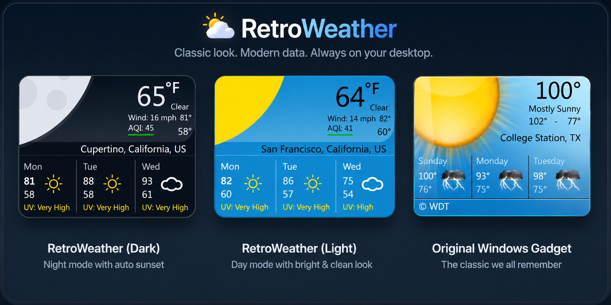

# RetroWeather 🌤️

If you used Windows Vista or 7, you probably remember the sidebar widgets. A little weather card sitting in the corner of your desktop, showing the temperature and a sun or cloud icon. Simple, clean, always there. Then Windows 8 came out and Microsoft just... removed them. I missed them. So I built this.

RetroWeather is a [Rainmeter](https://www.rainmeter.net/) skin that brings back the old weather widget. It looks and feels like those old Vista/7 gadgets, but underneath it's pulling live weather, air quality, UV index, and wind data from a modern API.. for free, no account or API key needed. You can switch between Celsius and Fahrenheit, change your location by typing any city. Oh, and it automatically shifts into a dark mode moon after sunset.

Retroweather works on Windows 7 and above. 



---

## Features

- **Live weather** — current temperature, conditions, high/low
- **3-day forecast** — with weather icons, temperatures, and UV index
- **Wind speed** — auto-converts between mph and km/h based on unit selection
- **Air Quality Index (AQI)** — with color-coded indicator bar
- **Day/Night mode** — automatically switches based on local sunrise/sunset
- **Celsius/Fahrenheit toggle** — via right-click context menu
- **Location switcher** — type any city name or US zip code to change location
- **Meteocons weather icons** — color-coded by condition (sun = yellow, cloud = white, rain = blue, etc.)
- **Auto-updates** — refreshes every 5 minutes
- **No API key required** — uses the free Open-Meteo API

---

## Requirements

- [Rainmeter 4.5+](https://www.rainmeter.net/)
- Windows 7 SP1 and above 
- Windows 7 users only: [Windows Management Framework 5.1](https://www.microsoft.com/en-us/download/details.aspx?id=54616) required for the location switcher
- [Meteocons font](https://www.alessioatzeni.com/meteocons/) (included in `@Resources/Fonts`)

---

## Installation

1. Download or clone this repository
2. Copy the `RetroWeather` folder to your Rainmeter Skins directory:
   
   ```
   Documents\Rainmeter\Skins\RetroWeather\
   ```
4. Open Rainmeter Manager, find **RetroWeather** and click **Load**
5. The Meteocons font will be loaded automatically from `@Resources\Fonts\`

---

## Configuration

Open `Retroweather.ini` and edit the `[Variables]` section:

```ini
[Variables]
Latitude=YOUR_LATITUDE
Longitude=YOUR_LONGITUDE
Location=Your City, State
TempUnit=fahrenheit        ; or celsius
UnitLetter=+               ; + for °F, * for °C
UseMPH=1                   ; 1 for mph, 0 for km/h
WindUnit=mph               ; or km/h
```

To find your latitude and longitude, go to [Google Maps](https://maps.google.com), right-click your location and copy the coordinates.

---

## Location Switcher

Right-click the widget and select **Change Location...** to type any city name or US zip code. The skin will automatically geocode the location using the [Open-Meteo Geocoding API](https://open-meteo.com/en/docs/geocoding-api) and update.

> **Windows 7 users:** The location switcher requires PowerShell 5.1. Install [WMF 5.1](https://www.microsoft.com/en-us/download/details.aspx?id=54616) if it doesn't work. You may also need to enable TLS 1.2 — see the [Windows 7 Notes](#windows-7-notes) section below.

---

## Right-Click Menu
Right-click the widget and select "custom skin actions" for the following options: 
| Option | Description |
|---|---|
| Refresh weather | Forces an immediate weather update |
| Use Celsius | Switches to °C and km/h |
| Use Fahrenheit | Switches to °F and mph |
| Change Location... | Opens location input dialog |

---

## APIs Used

| API | Purpose | Cost |
|---|---|---|
| [Open-Meteo Forecast](https://open-meteo.com/en/docs) | Weather & UV index | Free |
| [Open-Meteo Air Quality](https://open-meteo.com/en/docs/air-quality-api) | AQI | Free |
| [Open-Meteo Geocoding](https://open-meteo.com/en/docs/geocoding-api) | Location search | Free |

No API key needed. No account. No limits that matter for personal use.

---

## AQI Color Scale

| Color | AQI Range | Category |
|---|---|---|
| 🟢 Green | 0–50 | Good |
| 🟡 Yellow | 51–100 | Moderate |
| 🟠 Orange | 101–150 | Unhealthy for Sensitive Groups |
| 🔴 Red | 151–200 | Unhealthy |
| 🟣 Purple | 201–250 | Very Unhealthy |
| 🟤 Maroon | 251+ | Hazardous |

---

## Windows 7 Notes

Windows 7 ships with PowerShell 2.0 which lacks TLS 1.2 support, required by the Open-Meteo API. To fix this:

1. Install [WMF 5.1](https://www.microsoft.com/en-us/download/details.aspx?id=54616) — download `Win7AndW2K8R2-KB3191566-x64.zip`, extract it, and run the `.msu` file
2. Restart your computer
3. The location switcher should now work

---

## Credits

- Weather data by [Open-Meteo](https://open-meteo.com/) (CC BY 4.0)
- Icons by [Meteocons](https://www.alessioatzeni.com/meteocons/)
- Built with [Rainmeter](https://www.rainmeter.net/)

---
## FAQ

<details>
<summary>Can I change the widget's colors or size?</summary>
<br>
Yes. Open <code>Retroweather.ini</code> and edit the color variables at the top — <code>Blue</code>, <code>DarkBlue</code>, <code>White</code>, etc. — using RGBA values. To resize, adjust the width and height values in <code>[MeterBackground]</code> and reposition the meters accordingly.
</details>

<details>
<summary>Why is wind speed showing zero?</summary>
<br>
The wind data is fetched from a separate API call. It may take a few extra seconds to load after the widget first appears. If it stays at zero, right-click and hit <strong>Refresh weather</strong>.
</details>

<details>
<summary>Why does the location switcher open a command window briefly?</summary>
<br>
The location switcher runs a PowerShell script via the RunCommand plugin. The brief window flash is normal — it closes automatically once the script finishes and the skin refreshes with the new location.
</details>

<details>
<summary>How do I find my latitude and longitude?</summary>
<br>
Go to <a href="https://maps.google.com">Google Maps</a>, right-click your location, and the coordinates will appear at the top of the context menu. Copy them into the <code>Latitude</code> and <code>Longitude</code> fields in <code>Retroweather.ini</code>.
</details>

<details>
<summary>Can I add more forecast days?</summary>
<br>
The widget currently shows 3 days. Open-Meteo supports up to 16 days of forecast data, but adding more days would require adding new measures and meters to the skin file for each additional day.
</details>

<details>
<summary>Can I run multiple instances with different locations?</summary>
<br>
Yes. Copy the entire skin folder, give it a different name, load it separately in Rainmeter Manager, and set different coordinates in each copy's ini file.
</details

<details>
<summary>Where do I change the default location in the code?</summary>
<br>
Open <code>Retroweather.ini</code> and find the <code>[Variables]</code> section near the top. Edit <code>Latitude</code>, <code>Longitude</code>, and <code>Location</code> to your coordinates and city name.
</details>

<details>
<summary>Where is the weather API URL defined?</summary>
<br>
In the <code>[Variables]</code> section, look for <code>WeatherURL</code>. It's built dynamically using your <code>Latitude</code>, <code>Longitude</code>, and <code>TempUnit</code> variables so it updates automatically when you switch units or change location.
</details>

<details>
<summary>How does the day/night mode work in the code?</summary>
<br>
<code>[MeasureSun]</code> fetches live sunrise and sunset times as Unix timestamps. <code>[MeasureDarkMode]</code> then compares the current time against those values. If it's before sunrise or after sunset it fires <code>IfTrueAction</code> which swaps the color variables and adds moon shapes to <code>[MeterSun]</code>.
</details>

<details>
<summary>How does the location switcher work under the hood?</summary>
<br>
When you select Change Location, Rainmeter triggers <code>[MeasureRunBat]</code> which uses the RunCommand plugin to launch <code>ChangeLocation.ps1</code>. The script shows an input dialog, calls the Open-Meteo Geocoding API to convert the city name to coordinates, then directly rewrites the <code>Latitude</code>, <code>Longitude</code>, and <code>Location</code> values in the ini file before Rainmeter refreshes.
</details>

<details>
<summary>How are the weather icons rendered without image files?</summary>
<br>
The icons are characters from the Meteocons font. Each weather code is substituted for a specific letter in <code>[MeasureD0Icon]</code>, <code>[MeasureD1Icon]</code>, and <code>[MeasureD2Icon]</code>. When those letters are rendered using the Meteocons font face in the meter, they appear as weather symbols.
</details>

<details>
<summary>How does the icon color change per condition?</summary>
<br>
Each icon meter has three companion measures — <code>ColorR</code>, <code>ColorG</code>, and <code>ColorB</code> — that use Substitute to map weather codes to RGB values. The meter's <code>FontColor</code> then references those three measures dynamically to build the final color.
</details>
---
## License

MIT License — free to use, modify, and share.
